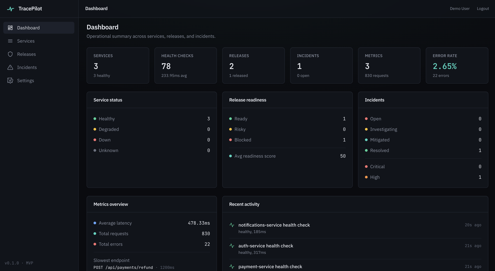
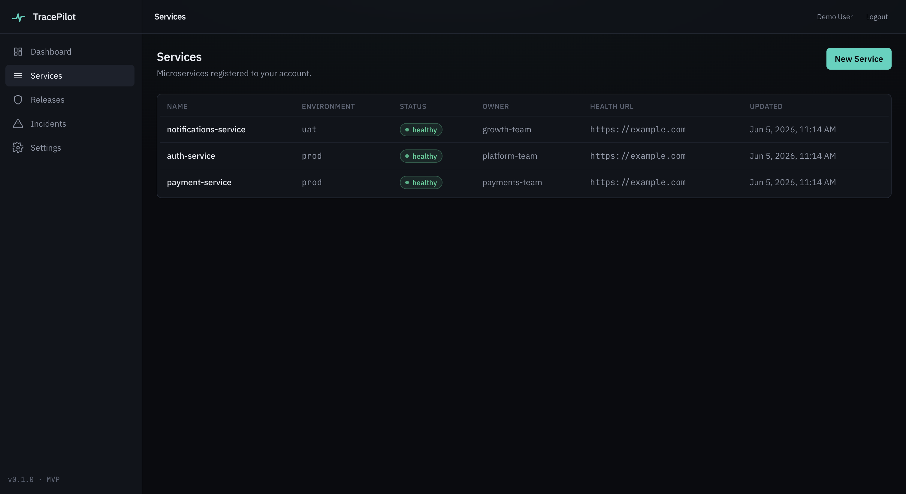
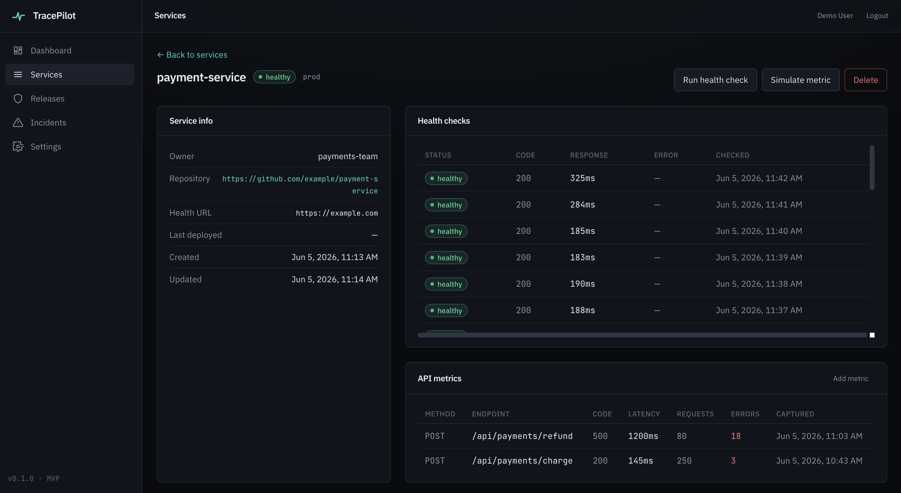
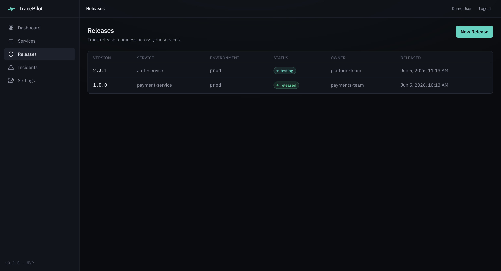
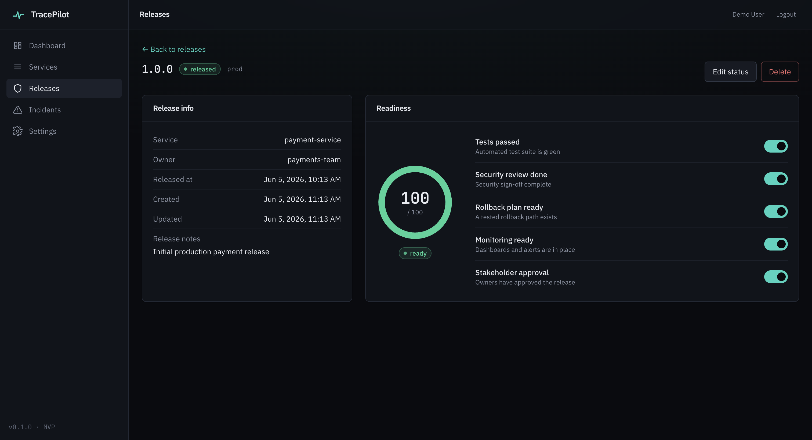
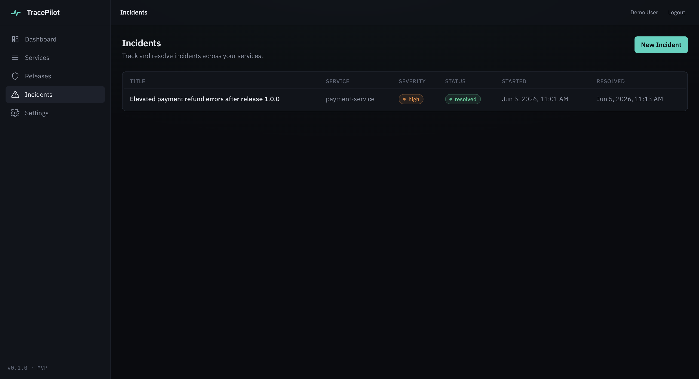
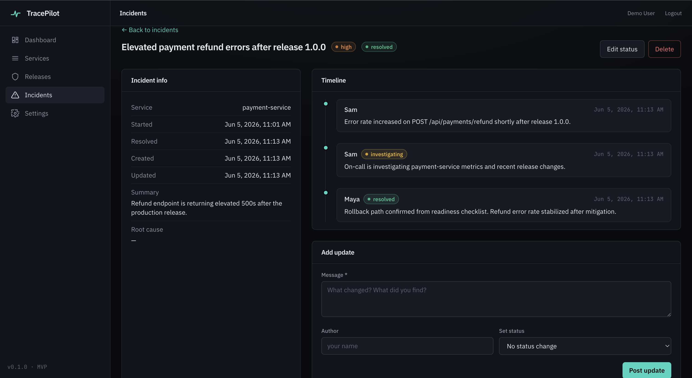
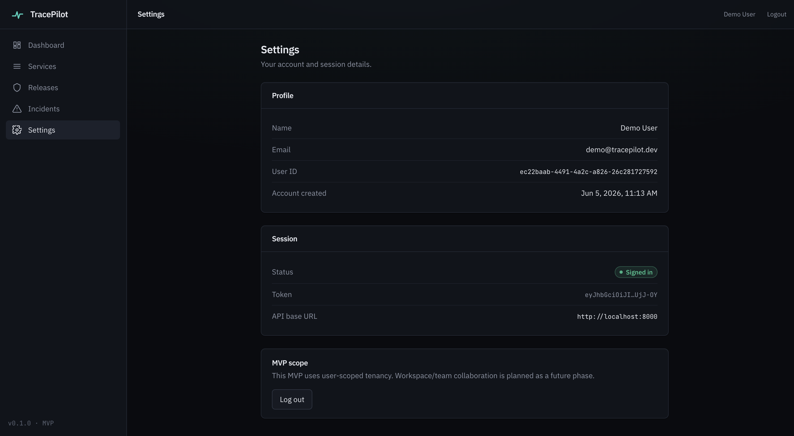

# TracePilot

> TracePilot is a release intelligence and observability MVP for small engineering teams that helps answer: **"Is this release safe, and if something broke, which release broke it?"**

TracePilot connects the operational signals a small team already has — services, releases, health checks, API latency/error metrics, rollback-readiness checklists, and incidents — into a single loop so that when something degrades, the path back to the likely cause is short.

**TracePilot's wedge is correlation, not collection.** It does not try to out-instrument Datadog, replace PagerDuty, or be a feature-flag platform. It assumes a small team (roughly 2–15 engineers) that has outgrown "just check the logs" but cannot justify a full Datadog + PagerDuty + LaunchDarkly stack.

> The MVP intentionally favors breadth of integration over depth in any single observability silo.

---

## Overview

TracePilot is a full-stack portfolio MVP: a FastAPI + PostgreSQL backend and a React + TypeScript frontend, wired end to end. It models the operational loop:

## Screenshots

Screenshots live in `docs/img/`. To regenerate them, seed the demo data (`docker compose exec api python scripts/seed_demo_data.py`), log in as `demo@tracepilot.dev` / `password123`, and follow [docs/SCREENSHOTS.md](docs/SCREENSHOTS.md). If the images aren't present yet, add them to `docs/img/` using the filenames below.

_Dashboard — operational summary across the whole loop._

_Services — the registry everything else hangs off of._

_Service detail — health checks plus the healthy charge vs. failing refund endpoints._

_Releases — version and lifecycle tracking._

_Release readiness — a five-item checklist scored 0–100._

_Incidents — severity and status, scoped to the affected service._

_Incident timeline — updates drive status; resolving auto-stamps the resolution time._

_Settings — honest MVP scope, with team collaboration noted as future work._

## Deployment & operations

- [docs/DEPLOYMENT.md](docs/DEPLOYMENT.md) — running locally and deploying publicly (frontend on Vercel/Netlify, backend on Render/Railway/Fly.io, managed Postgres), including required env vars and CORS notes.
- [docs/FINAL_DEMO_CHECKLIST.md](docs/FINAL_DEMO_CHECKLIST.md) — step-by-step checklist before showing the project to a recruiter or interviewer.
- [docs/PRODUCTION_CHECKLIST.md](docs/PRODUCTION_CHECKLIST.md) — an honest list of what production-readiness would require (this is a portfolio MVP, not production software).

> The frontend requires `VITE_API_BASE_URL` to point at the backend (e.g. `http://localhost:8000` locally, or your deployed backend URL). When deploying, set the backend's `CORS_ORIGINS` to the deployed frontend origin (comma-separated, no trailing slash).
